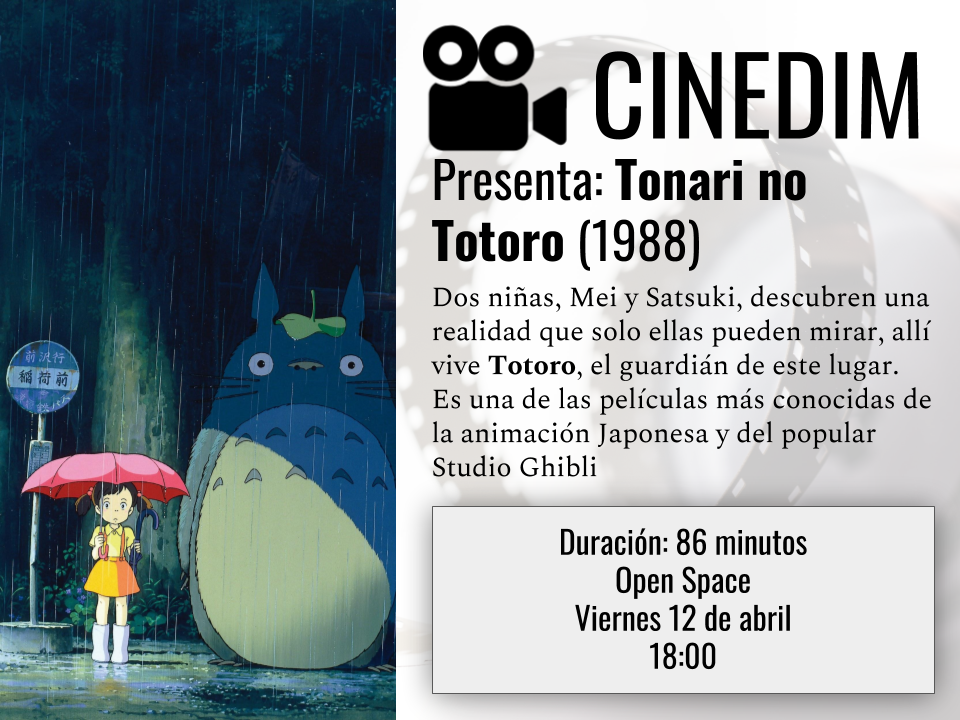

Since 2012 I've been an avid fan of Cinema. I love watching and discussing films even if I'm not a filmmmaker myself.

## Cinema showings

In 2019, I organized cinema showings for the students of mathematical engineering alongside Francisco Aliaga and Vicente Ocqueteau.

1. April 12th: My Neighbour Totoro (1988)
2. April 26th: Fantastic Mr Fox (2009)
3. May 10th: Ex Machina (2015)
4. June 14th: Blair Witch Project (1999)
5. August 7th: The end of Evangelion (1997)
6. August 21th: 12 angry men (1957)
7. September 25th: El club (2015)
8. October 9th: The Thing (1982)

## Screenwriting

In 2024 I took a couse given by [Eduardo Zapata](https://eduardozapata.com.mx/) for [Estudio Magnolia](https://www.estudiomagnolia.com/) where I worked on a project about [Monte Verde](https://es.wikipedia.org/wiki/Monte_Verde). I hope life isn't too short to publish it when it's ready, alongside other projects.