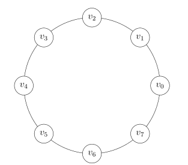

For my masters thesis at Universidad de Chile I worked on the following problem:

**Problem statement**
Let \\(C\\) be a cycle with n vertex \\(C=(V,E_0)\\), and \\(E\\) a set of edges such that \\((V, E_0 + E)\\) is a \\(3\\)-vertex-connected graph.  We want to study the problem of adding the least amount of edges of \\(E\\) to make the cycle \\(3\\)-vertex-connected. This means, we want to find a feasible set of edges  \\(F \subseteq E\\) of minimun size such that  \\(C'=(V,E_0 \cup F)\\) is \\(3-\\)vertex-connected.

**Thesis defense:** May 28th, 2021

### Objectives

1. Study the complxity of the problem of augmenting the vertex-connectivity of a cycle by one. 
2. Study the linear programming formulation of the problem
3. Design Approximation algorithms to solve the problem.

### Documentss

- [Local copy of the thesis (in spanish)](memoria.pdf)
- [Thesis slides (in spanish)](Presentacion-Tesis.pdf)
- [Acknowledgments (in spanish)](/agradecimientos/)
- [WAOA article](https://link.springer.com/chapter/10.1007%2F978-3-030-92702-8_1)
- [Arxiv article](https://arxiv.org/pdf/2111.02234.pdf)
- [WAOA presentation](https://www.youtube.com/watch?v=wvxBP7t-TBI)