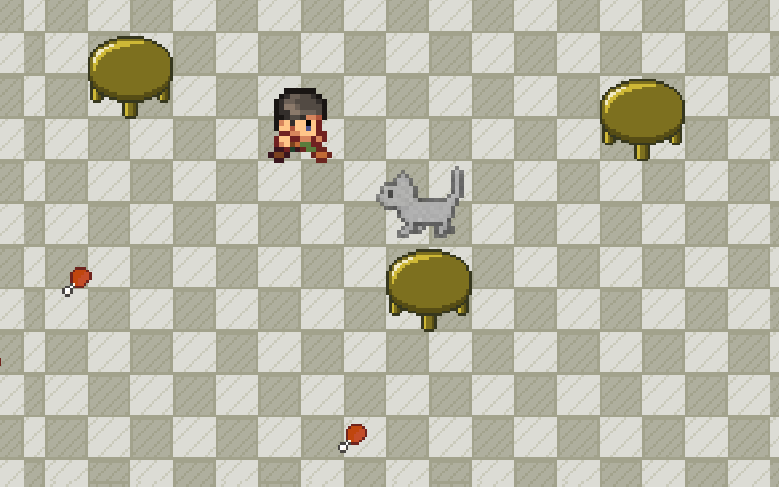
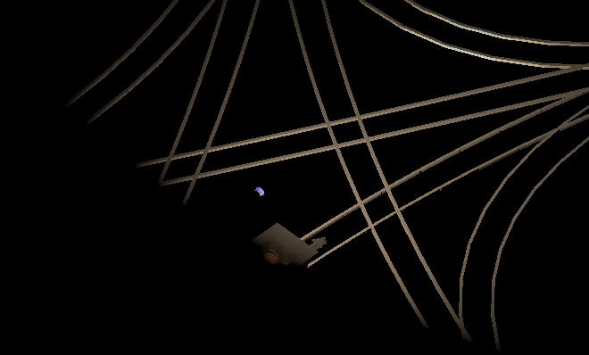
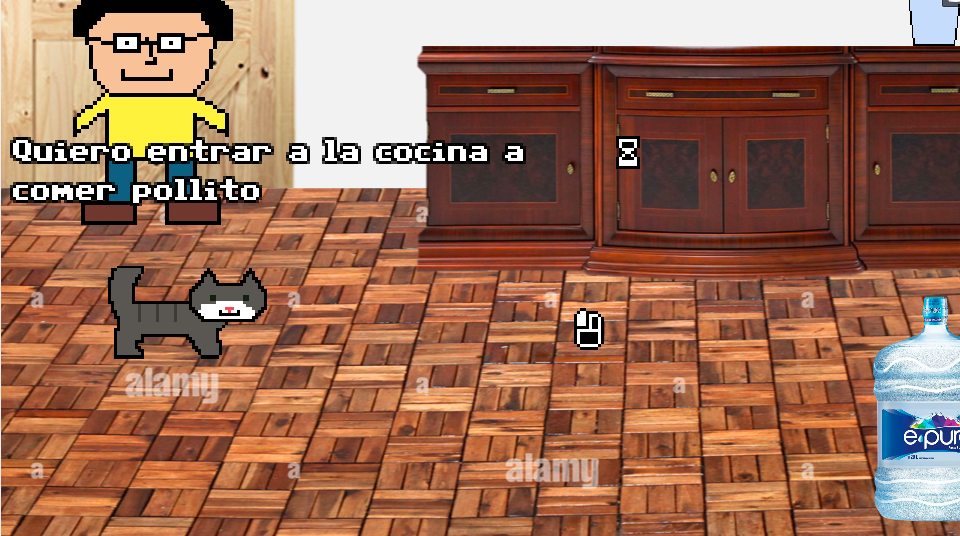
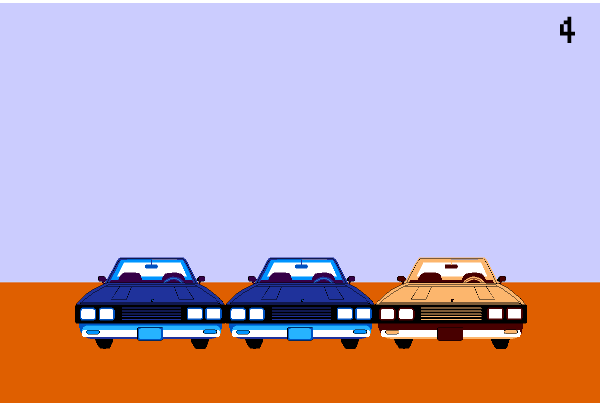
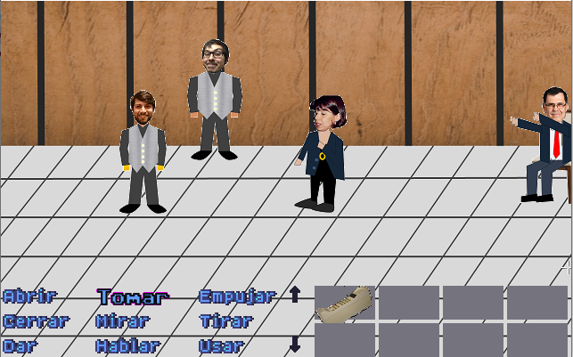

Since 2020 I've developed videogames because I find it cool.

## Benito Game 2024

Sequel to Benito Simulator. In this game, you have to eat all the ckicken in the kitchen before Pancho catches you.

Made in Godot for friends and family for a party to celebrate the 10th birthday of my cat.

## Maldición del Alicanto (feat. Francisco Aliaga & Gerald Cathalifaud)

Created for [Chile Chorijam 1](https://itch.io/jam/ccj) in 2023 with a team of programmers and mathematicians from Chile.

Based on chilean mithology, you need to find the way out of the maze of railroads in a mine to escape. My contributions relied in the creation of 3D assets with Blender, 2D graphics for the credits, and a lot of testng and planning. Available to play at [itch.io](https://mdl74fsre1hz.itch.io/maldicin-del-alicanto) (WARNING: loading is very slow)

## Benito Simulator

March 2023.

You are Benito (my cat) and you want to get inside the kitchen to eat chicken. Graphic adventure game created in Godot with the Popochiu Framework.

[Available in itch.io](https://panconqueso94.itch.io/benito-simulator)

## Dispararle a los autos viejos

2022.
Shoot the most old cars in 10 seconds! Created in Godot as a proof of concept.

[Available in itch.io](https://panconqueso94.itch.io/dispararle-a-los-autos-viejos)

## Las aventuras de JPUC

Minigame set in the prelude of a choir concert. Made in Adventure Game Studio the second week of April 2020. Done in the style of LucasArts Games as Monkey Island, Zak MacCraken, Day of the Tentacle and much more.

> *You're JPUC, the faculty Choir is about to present and the implements for singing are missing. Your mission is find what is missing and save the choir or the shame ¿Will you find the implements on time?*

**Download link for Windows**:

[LasAventurasDeJpuc.rar in this Notion site](https://www.notion.so/Videojuegos-7b3afc3389384557ac742564644f507d)
