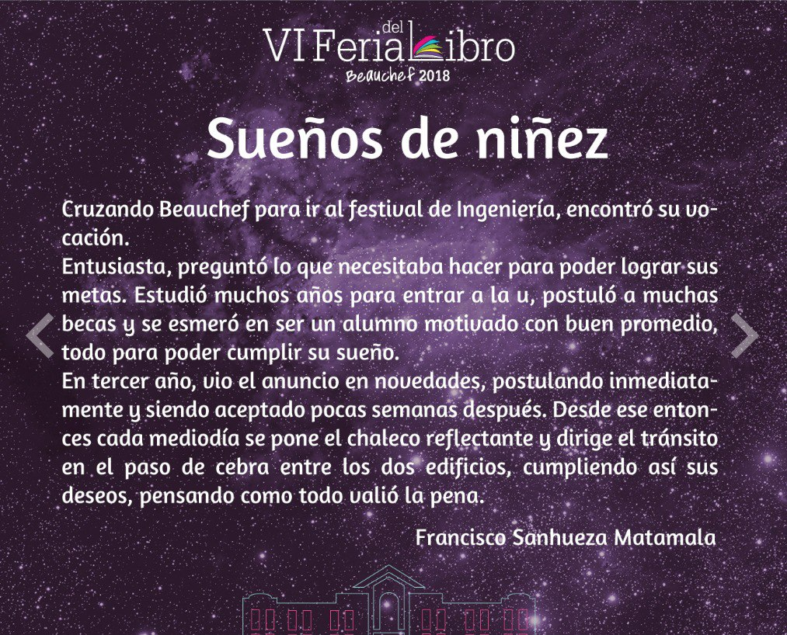

I've written a couple of micro stories in spanish for a couple of awards in my university.

## Edición 2017

### Coctel

> This micro story [won the third place](https://feriadellibro.ing.uchile.cl/2017/2017/04/27/ganadores-de-beauchef-en-100-palabras-reciben-reconocimientos/) in the award "Beauchef en 100 palabras" in 2017

Primero fue una titulación, luego un acto de cierre. De a poco mi vida se fue acomodando para poder acceder a toda comida gratis en la facultad para no gastar en alimentación.

Siete años después, he conocido a todas las autoridades, quienes siempre me reciben como uno más y me agradecen. Total, comida no falta y valoran que venga alguien para que no sobre.

Mi calidad física ha empeorado, he engordado 12 kilos y hace meses que no salgo de 851. Pero no estoy solo, muchos jóvenes están siguiendo mis pasos, agradecidos de las bondades de este lugar.

### Intento de asalto

Volvía cocido de club hípico, entré a la estación, saqué la tarjeta y crucé el torniquete, en el andén, el vagón no quería abrir, golpeé la puerta tan fuerte que se quebró. Estupefacto, lo único que atiné a hacer fue entrar al tren para arrancar de los guardias, me fondeé debajo de unas escalas y temí por mi vida.

Cuando me sentí muy mareado y a punto de vomitar activé el botón de pánico, aparecieron dos personas vestidas de negro que me auxiliaron y me advirtieron que saliera de ahí. Agarré mis cosas y salí discrétamente de Beauchef 851.

## Edición 2018

